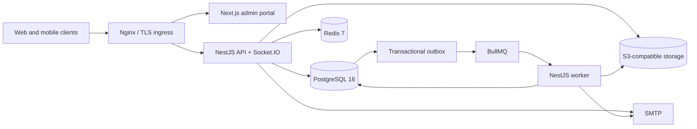

# Architecture

## Context and trust boundaries

The platform serves anonymous spectators, authenticated fans, team personnel, scorekeepers, tournament organizers, organization administrators, and exceptional platform operators. Nginx terminates the public application boundary and routes `/api/v1` and `/live` to the NestJS service while serving the Next.js portal. Mobile clients call the same versioned API.

PostgreSQL is the system of record for identity, authorization, competitions, committed scoring state, outbox events, audit records, jobs, media metadata, and privacy requests. Redis backs BullMQ delivery and ephemeral realtime/lease coordination. S3-compatible storage holds media and private exports; the database holds tenant ownership, state, checksum, and object key.

## Service structure

The API is a modular NestJS application. Authentication and authorization are separate: JWT authentication identifies the actor, while permission guards resolve active role assignments at organization, tournament, team, and game scope. Management, games, live scoring, public discovery, fan preferences, invitations, media, jobs, and observability each own a bounded module.

Shared packages publish framework-neutral Zod contracts and domain types. Both TypeScript clients consume the same envelope and error conventions. The Flutter app uses explicit decoders so untrusted responses remain a boundary concern.

## Data and consistency

All tenant-owned aggregates carry `organizationId`; composite uniqueness and foreign keys preserve the domain graph. Mutable aggregates use integer versions for optimistic concurrency. Scores are accepted only within a database transaction that locks the game, verifies the organization, assignment, lease, version, idempotency key, period, and team, appends an immutable event, updates the snapshot, writes audit/outbox records, and then commits. Socket.IO broadcasts only the committed snapshot.

The transactional outbox separates durable state changes from external work. The dispatcher uses recoverable states and attempts; handlers persist unique job keys so redelivery is safe. A failed external transport is visible as failed/dead-letter work rather than silently acknowledged.

## Availability and degradation

- PostgreSQL unavailable: readiness fails and writes stop.
- Redis unavailable: readiness reports degraded, queues/realtime leases are impaired, and authoritative database validation still prevents invalid scoring commits.
- Object storage unavailable: existing metadata and non-media workflows continue; signed upload/export operations fail visibly and can retry.
- SMTP/provider unavailable: outbox/job records retain observable failure and retry state.
- Websocket interruption: clients reconnect and fetch the current REST snapshot/version before accepting newer events.

## Deployment topology

Compose is a single-host reference topology. Production should use managed or independently durable PostgreSQL, Redis, object storage, SMTP, TLS ingress/WAF, centralized secrets, logs/metrics, backup replication, and at least two stateless API instances plus independently scaled workers. Sticky sessions are not required for correctness; multi-node Socket.IO fan-out needs the deployment Redis adapter before horizontal realtime scaling.

## Key decisions

- UUID identifiers avoid tenant-revealing sequences.
- Soft deletion/archive is used for operational records; audit and scoring events are append-only.
- No implicit seed data or startup bootstrap exists.
- The provider interfaces remain honest: unconfigured push is disabled, not simulated.
- Configuration validates at startup and rejects placeholders in production.
